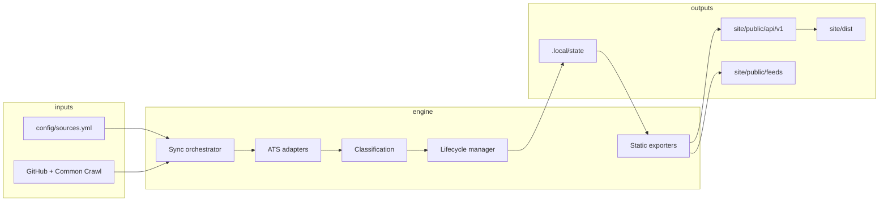

# OpenRoleRadar Architecture

OpenRoleRadar is a zero-cost pipeline that polls first-party early-career job postings from public ATS APIs, normalizes them into a stable data model, and publishes static JSON APIs plus a searchable site on GitHub Pages.

Discovery (GitHub code search / Common Crawl) can propose new boards; promotion is gated by validation confidence. The static site never scrapes live — it only serves the last Actions publish.

## Design goals

- **First-party only** — index employer-owned ATS boards, never aggregators.
- **Deterministic IDs** — the same company/tenant always maps to the same `company_id` and `source_id`.
- **Static publication** — no database server; live state is a versioned blob restored between CI runs.
- **Evidence-based enrichment** — mobility and eligibility signals carry confidence and excerpts.
- **Fork-friendly validation** — contributors can propose sources without granting write access.

## Repository layout

```
Open-Role-Radar/
├── config/           # Human-edited YAML (sources, taxonomy, denylist)
├── engine/           # Python sync engine (adapters, discovery, export)
├── site/             # Astro static site consuming exported JSON
├── schemas/          # JSON Schema for public records
├── scripts/          # Bootstrap, sync wrapper, PR validation
├── docs/             # Architecture and operations documentation
└── .github/workflows # CI, sync, discovery, security automation
```

## Data flow



## Core components

### Sync orchestrator (`engine/src/openroleradar/sync.py`)

Selects due sources by poll tier, fetches listings through registered adapters, normalizes `RawJob` records into `Job` models, updates lifecycle state, and persists `LiveState` to `.local/state`.

### Adapters (`engine/src/openroleradar/adapters/`)

Each adapter implements a common interface for a specific ATS (Greenhouse, Lever, Ashby, SmartRecruiters, JSON-LD). Workday is registered for detection only (`supported=False`) until a tenant-safe fetch path exists. Adapters return structured job payloads without writing to disk directly.

### Discovery (`engine/src/openroleradar/discovery/`)

- **GitHub code search** — finds public references to known ATS host patterns.
- **Common Crawl** — scans WARC indexes for career board URLs.
- **Career site inspection** — probes seed domains for embedded ATS links.

Candidates pass through `validate.py`, which enforces SSRF checks, aggregator denylisting, and confidence thresholds before promotion.

### Classification (`engine/src/openroleradar/classify/`)

Infers `career_level`, disciplines, workplace type, eligibility, and mobility benefits from title and description text using configurable taxonomies in `config/taxonomy.yml` and `config/skills.yml`.

### Export (`engine/src/openroleradar/export/`)

- **Static API** — versioned JSON under `site/public/api/v1/`.
- **Site data shards** — hashed buckets for fast client-side loading.
- **Atom/RSS feeds** — public syndication endpoints.
- **README stats** — replaces content between `GENERATED_STATS` markers.
- **Archives** — monthly compressed datasets for research use.

### Site (`site/`)

An Astro + React static application that reads exported shards at build time. GitHub Pages serves `site/dist` with base path `/Open-Role-Radar/`.

## State management

Live state is stored locally under `.local/state` during CI and cached between workflow runs using GitHub Actions cache keys prefixed `live-state-`. This avoids committing volatile job data to git while keeping runs incremental.

Long-term archives are written to `.local/archives/` and uploaded as workflow artifacts.

## Security model

- HTTP client enforces timeouts, redirect limits, response size caps, and per-host concurrency.
- Seed validation rejects private/reserved IP resolutions (SSRF guard).
- Aggregator domains are denylisted in `config/aggregators-denylist.yml`.
- Workflows use least-privilege `permissions` blocks; fork PR validation is read-only.

## Versioning

Schema and export versions are declared in `config/project.yml` under `versions`. Bump these when making breaking changes to exported JSON.

## Related documents

- [DATA_MODEL.md](DATA_MODEL.md)
- [SOURCE_DISCOVERY.md](SOURCE_DISCOVERY.md)
- [API.md](API.md)
- [OPERATIONS.md](OPERATIONS.md)
